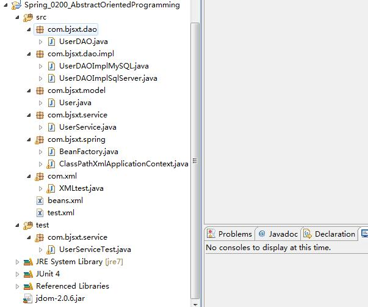
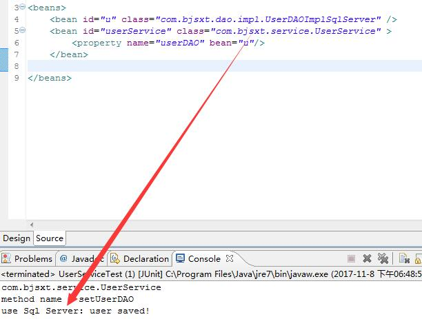
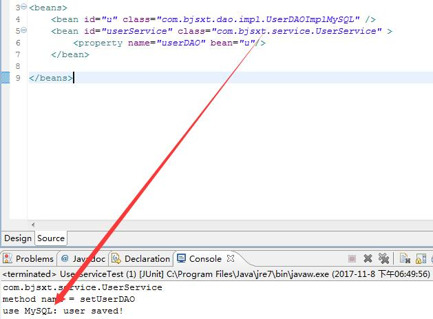

Spring 依赖注入模拟

* Java 反射机制， 动态代理模式，工场模式

* jdom xml文件解析

* 抽象，面向抽象编程（解耦，灵活）


# 主要类




* User，用户实体模型

* UserDAO，抽象对User的数据库操作
 
* UserDAOImplMySQL, UserDAOImplSqlServer 实现UserDao的接口，分别用不同的数据库操作，一个MySQL,一个Sql Server

* UserService, 业务逻辑层操作


# 耦合太强的问题

```
// serverce 业务逻辑，除了数据库操作，还可以操作其它的
public class UserService {
	
	//引用 UserDao(具体实现不一样)
	private UserDAO userDAO;  
	
	public void add(User user) {
		userDAO.save(user);
	}
	public UserDAO getUserDAO() {
		return userDAO;
	}
	public void setUserDAO(UserDAO userDAO) {
		this.userDAO = userDAO;
	}
}
```

 
UserService中用到了UserDAO，可以直接new一个，不过不灵活:

即
```
public class UserService {
	
	//引用 UserDao(具体实现不一样)
	private UserDAO userDAO = new UserDAOImplMySQL();  
	// 或者
	// private UserDAO userDAO = new UserDAOImplSqlServer(); 
	// ...
	
	public void add(User user) {
		userDAO.save(user);
	}
	public UserDAO getUserDAO() {
		return userDAO;
	}
	public void setUserDAO(UserDAO userDAO) {
		this.userDAO = userDAO;
	}
}
```

* UserDao可以有很多种实现，如果想用别的实现，每次要new不同的

* 如果UsserService 引用了别的Dao，那么组合情况更多；Dao与Service的关系很紧

需要解耦:

* 让配置文件去做这样的处理，程序启动的时候UserDao根据配置文件注入好；如果要改动，只需要改配置文件，而不是直接该源代码


# 模拟-依赖注入

beans.xml 中定义了类关系，所以需要解析xml文件

这里使用了 jdom (jar, 使用方法可以网上搜)

主要是ClassPathXmlApplicationContext

```
// id -> 具体类的一个映射
private Map<String , Object> beans = new HashMap<String, Object>();

//IOC Inverse of Control DI Dependency Injection
public ClassPathXmlApplicationContext() throws Exception {
	SAXBuilder sb=new SAXBuilder();
    
    Document doc=sb.build(this.getClass().getClassLoader().getResourceAsStream("beans.xml")); //构造文档对象
    Element root=doc.getRootElement(); //获取根元素HD
    List list=root.getChildren("bean");//取名字为disk的所有元素
    
    for(int i=0;i<list.size();i++){
       Element element=(Element)list.get(i);
       String id=element.getAttributeValue("id");
       String clazz=element.getAttributeValue("class");
       
       // 反射构造对象
       Object o = Class.forName(clazz).newInstance();
       System.out.println(id);
       System.out.println(clazz);
       beans.put(id, o); // id-对象的映射 存储到beans中
       /*
	<bean id="u" class="com.bjsxt.dao.impl.UserDAOImplMySQL" />
		<bean id="userService" class="com.bjsxt.service.UserService" >
			<property name="userDAO" bean="u"/>
		</bean>
	*/
       
       // property属性：需要注入相应的对象
       for(Element propertyElement : (List<Element>)element.getChildren("property")) {
	   String name = propertyElement.getAttributeValue("name"); //userDAO
	   String bean = propertyElement.getAttributeValue("bean"); //u
	   
	   // bean属性，就是id,然后映射 就能得到对象
	   Object beanObject = beans.get(bean);//UserDAOImpl instance
	
	   // 对象的 setUserDAO方法, 先获取方法名，然后invoke,注入
	   String methodName = "set" + name.substring(0, 1).toUpperCase() + name.substring(1);
	   System.out.println("method name = " + methodName);
	   // setUserDAO(UserDao u); 方法
	   
	   Method m = o.getClass().getMethod(methodName, beanObject.getClass().getInterfaces()[0]);
	   m.invoke(o, beanObject);
       }
       
       
    }  
  
}

// 根据id得到对象
public Object getBean(String id) {
	return beans.get(id);
}
```


* 利用反射，动态代理

从配置文件中可以得到注入关系，构造出对象，然后可以调用对象的方法，完成类似对象new的实现，这样直接注入


程序启动的时候，相当于对象间的使用已经给配置好了，然后不需要new, 直接使用就行


# junit测试验证

```
public class UserServiceTest {

	@Test
	public void testAdd() throws Exception {
		// Spring自动装配
		// 读取配置文件，然后得到各个映射关系
		// 程序初始化，把这些东西放到一个容器中
		BeanFactory applicationContext = new ClassPathXmlApplicationContext();
		
		UserService service = (UserService)applicationContext.getBean("userService");

		User u = new User();
		u.setUsername("zhangsan");
		u.setPassword("zhangsan");
		service.add(u);
	}

}
```

只需要修改配置文件






**注：代码来自马士兵Spring2.5讲解，自己实践**